<!-- Generated from frontend/src/modules/guidelines/content by `npm run docs:manual`. Edit the content there, not this file. -->

# AIGH Nursing Workforce — User Manual (V04, v0.1.0)

The same guide is in the application (side menu → Guidelines) and as a printable PDF: [generated/AIGH_Nursing_Workforce_User_Manual_V04.pdf](generated/AIGH_Nursing_Workforce_User_Manual_V04.pdf). Every task is checked against the code; [GUIDELINES_COVERAGE.md](GUIDELINES_COVERAGE.md) shows the trace from screen to rule. Status: **Implemented**, **Partially implemented** (part of it is API-only or missing — said in the task), or **Planned / not currently available**.

## Contents

1. [Getting started](#1-getting-started)
2. [Roles and permissions](#2-roles-and-permissions)
3. [Approvals (four-eyes)](#3-approvals-four-eyes)
4. [Dashboard](#4-dashboard)
5. [Nurses](#5-nurses)
6. [Contracts](#6-contracts)
7. [Credentials](#7-credentials)
8. [Eligibility](#8-eligibility)
9. [Workforce](#9-workforce)
10. [Nursing KPIs](#10-nursing-kpis)
11. [Roster and scheduling](#11-roster-and-scheduling)
12. [Attendance](#12-attendance)
13. [Notifications](#13-notifications)
14. [Nursing Administration](#14-nursing-administration)
15. [Audit & Compliance](#15-audit--compliance)
16. [Employee self-service](#16-employee-self-service)
17. [Security and your account](#17-security-and-your-account)
18. [How the hospital system works](#18-how-the-hospital-system-works)
19. [Troubleshooting](#19-troubleshooting)
20. [Quick reference](#20-quick-reference)

## 1. Getting started

The AIGH Nursing Workforce system keeps one record of every nurse — contract, credentials and eligibility — and lets supervisors build rosters only from nurses who are allowed to work. Every screen shows data the server has checked; every change is recorded in the audit trail.

**Who:** Everyone  
**Where:** Open the hospital address in Chrome, Edge or Firefox and sign in.

> **Note:** What you see depends on your role and scope. A menu item or button that is missing is not an error: your account has no right to it. Ask HR if you need it.

> **Important:** Never share your password, recovery codes or the two-factor codes from your phone. Every action is recorded under the account that did it.

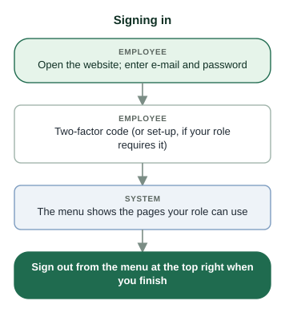

**The side menu**

| Menu item | What it is for | Who sees it |
| :--- | :--- | :--- |
| Dashboard | Welcome and system status | Everyone |
| Nurses | Staff master records, onboarding, login invitations | HR Admin, System Admin, Supervisor |
| Contracts | Employment contracts and their approval | Everyone (employees see their own) |
| Credentials | Licences and certificates, review queue, requirements, catalogue | HR Admin, System Admin, Supervisor |
| My Profile | Your own record and phone numbers | Accounts linked to an employee |
| My data | Your personal-data requests (PDPL) | Accounts linked to an employee |
| My Credentials | Your own credentials, renewals and eligibility | Accounts linked to an employee |
| Eligibility | Who may work today and why; emergency waivers | HR Admin, System Admin, Supervisor |
| Workforce | Units, beds, departments, positions, coverage targets | Everyone (changes: HR / System Admin) |
| Nursing KPIs | Nurse-to-bed indicators | HR Admin, System Admin, Supervisor |
| Roster & Scheduling | The roster board; employees see their own shifts | Everyone (drafting: Supervisor) |
| Attendance | Planned versus actual (clock-ins) | Everyone (employees see their own) |
| Notifications | Your notices — the bell at the top shows how many are unread | Everyone |
| Audit & Compliance | Audit trail and request log | System Admin |
| Sign-in history | Your own sessions | Everyone |
| Two-factor sign-in | Authenticator, recovery codes, sign-in e-mail, Telegram | Everyone |
| Nursing Administration | Accounts, roles, approvals, data protection and system tools | HR Admin, System Admin |
| Guidelines | This guide | Everyone |

**The top bar**

| Control | What it does |
| :--- | :--- |
| ☰ | Folds or unfolds the side menu |
| Bell | Opens Notifications; the number is how many are unread |
| Moon / bulb | Switches dark or light mode (remembered on this browser) |
| ع / EN | Switches Arabic or English; the layout turns right-to-left in Arabic |
| Your name | Your roles, Change password, Sign-in history, Two-factor sign-in, Sign out |
| Orange "Elevated until …" | A System Admin's temporary rights are on (see Security) |

### 1.1 Sign in

**Status:** Implemented  
**Roles:** Employee, Supervisor, HR Admin, System Admin

**Purpose.** Open your account securely.

**Who can perform it.** Everyone with an account.

**Before you start.**

- Your sign-in e-mail and password (from HR, or chosen through an invitation link).
- For Supervisor, HR Admin and System Admin: a phone with an authenticator app (Microsoft or Google Authenticator).

**Steps.**

1. Open the website. Check the padlock in the address bar; never continue past a certificate warning.
2. Enter your e-mail and password and click Sign in.
3. If asked, type the 6-digit code from your authenticator app. If your role requires two-factor sign-in and it is not set up yet, the set-up screen opens first (see Security).
4. The side menu shows the pages your role can use.

**System result.** You are signed in. The session is listed under Sign-in history.

**Approval.** None.

**Next step.** Start from the page for your task, or search this guide.

**Common problems.**

- *"Invalid email or password"* — Check Caps Lock and the address. After 5 wrong attempts on one account within 15 minutes the account is paused for up to 15 minutes; after 20 failed attempts from one network, everyone on that network is paused. Stop guessing and use Forgot password?.
- *The code is refused* — Use the current code (they change every 30 seconds and each works once), or sign in with a recovery code.

**Related.** [Security and your account](#17-security-and-your-account)

### 1.2 Forgotten password

**Status:** Implemented  
**Roles:** Employee

**Purpose.** Choose a new password when you cannot sign in.

**Who can perform it.** Staff accounts (no Supervisor, HR or administrator role) reset their own. Supervisor, HR and administrator accounts are reset by HR.

**Before you start.**

- Access to the mailbox of your sign-in e-mail.
- E-mail must be switched on by the hospital.

**Steps.**

1. On the sign-in page click Forgot password?.
2. Enter the e-mail address of your account and click Send link.
3. Open the link in the e-mail within 30 minutes.
4. Enter the new password twice (12 to 72 characters) and save.

**System result.** The password changes and every session of the account is signed out.

**Approval.** None. For any account, HR can send a reset link (valid 24 hours) from Nursing Administration → Accounts → Send reset link, after confirming who is asking.

**Next step.** Sign in with the new password.

**Common problems.**

- *No e-mail arrives* — Check the spam folder. Supervisor, HR and administrator accounts never receive a self-service link: ask HR. If e-mail is not switched on, HR helps you instead.

**Related.** [Security and your account](#17-security-and-your-account) · [Nursing Administration](#14-nursing-administration)

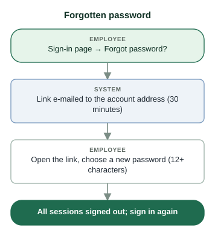

*Staff accounts only. Supervisor, HR and administrator accounts: HR sends the reset link (valid 24 hours).*

### 1.3 Create your account from an invitation

**Status:** Implemented  
**Roles:** Employee

**Purpose.** Activate your own login from the private link HR sent you.

**Who can perform it.** An employee who received an invitation e-mail.

**Before you start.**

- The invitation e-mail (the link works once and for 72 hours).
- Your Job Number.

**Steps.**

1. Open the link in the e-mail.
2. Enter your Job Number and continue.
3. Check the name, unit and position shown are yours (if not, stop and tell HR).
4. Enter a password of 12 to 72 characters twice and create the account.

**System result.** Your account is created and linked to your staff record. A newer invitation cancels the older link.

**Approval.** None.

**Next step.** Sign in. Check My Profile and My Credentials.

**Common problems.**

- *The link says it is invalid or expired* — Ask HR to send a new invitation.

**Related.** [Nurses](#5-nurses) · [Employee self-service](#16-employee-self-service)

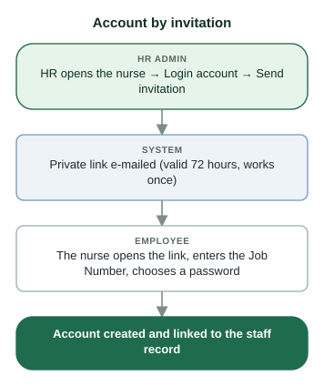

*Needs e-mail switched on, an Approved or Active contract and a valid contact e-mail on the staff record.*

## 2. Roles and permissions

Every account has the Employee view of its own records. HR gives extra roles — Supervisor, HR Admin, System Admin — each limited to a scope: some units, a department, or the whole hospital. The menu and buttons follow your roles, but the server checks every request on its own.

**Who:** Everyone  
**Where:** Your roles are listed under your name at the top right. The full table is in Nursing Administration → Access matrix.

> **Note:** A job title or position never gives a role: a Head Nurse is a Supervisor only if HR grants the Supervisor role.

> **Note:** Two-factor sign-in is required for Supervisor, HR Admin and System Admin.

**What each role is for**

| Role | Scope | Sees | Changes |
| :--- | :--- | :--- | :--- |
| Employee (every account linked to a staff record) | Own records | Own profile, contract, credentials, eligibility, shifts, clock-ins, notifications | Own phone numbers, own credentials and renewals, own personal-data requests |
| Supervisor | Assigned units | Nurses, contracts (reduced), credentials (compliance view, no documents), eligibility, KPI, attendance of those units | Rosters of those units; emergency waivers |
| HR Admin | Units, a department or hospital-wide | Everything about staff in scope | Staff records, contracts, credential decisions, requirements, accounts and roles in scope; hospital-wide HR also the catalogue and organisation |
| System Admin | Hospital-wide, dormant until elevated | Audit, background jobs, system tools; HR screens while elevated | System configuration while elevated (1–4 hours, with a reason) |

**Why something is missing or refused**

| You see | Usually because |
| :--- | :--- |
| A menu item is missing | Your role does not include that page (for example Audit & Compliance is System Admin only). |
| Nursing Administration shows only some tabs | HR Admin does not see System Admin tabs; a System Admin who has not elevated sees only the tools tabs. |
| A nurse is not in your list | The nurse is outside your scope (another unit or department), or the record was deleted. |
| A button is missing on a row | The action does not apply to that record's status, or it is your own record (nobody approves or reviews their own). |
| "Waiting for another administrator" | You asked for a protected change: a different administrator must approve it (see Approvals). |
| An error naming SCOPE, SELF or APPROVAL | The server refused the action under the rules above. Read the message; it says which rule. |

## 3. Approvals (four-eyes)

Some changes are too important for one person. They are saved as a request and take effect only when a different authorised administrator approves them in Nursing Administration → Approvals.

**Who:** HR Admin and System Admin  
**Screen:** `/admin`  
**Where:** Nursing Administration → Approvals.

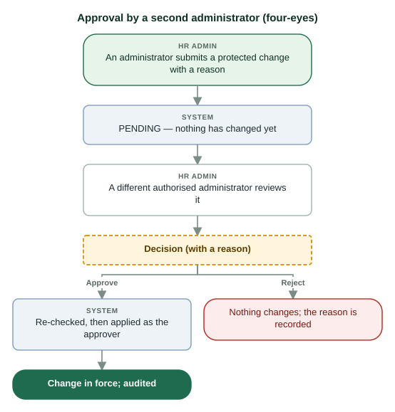

*Protected changes wait in Nursing Administration → Approvals. The person who asked can withdraw the request but never approve it.*

**What needs a second administrator**

| Change | Where it is asked for | Who may approve |
| :--- | :--- | :--- |
| Granting System Admin | Role assignments | Another administrator |
| Granting HR Admin with hospital-wide scope | Role assignments | Another administrator |
| New or changed credential type | Credentials → Catalog | Another hospital-wide administrator |
| New or changed credential category | Credentials → Categories | Another hospital-wide administrator |
| Hospital baseline import | Hospital baseline import | Another hospital-wide administrator |
| Approving a contract | Contracts | An HR person who did not create or submit it (not through Approvals) |

### 3.1 Approve or reject a request

**Status:** Implemented  
**Roles:** HR Admin, System Admin

**Purpose.** Apply, or turn down, a protected change another administrator asked for.

**Who can perform it.** HR Admin or System Admin (elevated), other than the person who asked; within the request's scope.

**Before you start.**

- Read the description: it shows the change (before → after) and the requester's reason.

**Steps.**

1. Open Nursing Administration → Approvals.
2. Find the Pending request.
3. Click Approve or Reject.
4. Write your reason (at least 5 characters) and confirm.

**System result.** Approve: the server checks the change again and applies it as you, in one step. Reject: nothing changes. Both are audited.

**Approval.** This is the approval.

**Next step.** The requester sees the new status. For a role grant, the person can sign in with the new role.

**Common problems.**

- *No Approve button, only "Your request — waiting for another administrator"* — You asked for it. Someone else must decide, or you can Withdraw it.
- *Approval refused because the item changed* — The record changed after the request; ask the requester to submit a new one.

**Related.** [Nursing Administration](#14-nursing-administration) · [Credentials](#7-credentials)

*Protected changes wait in Nursing Administration → Approvals. The person who asked can withdraw the request but never approve it.*

### 3.2 Withdraw your own request

**Status:** Implemented  
**Roles:** HR Admin, System Admin

**Purpose.** Cancel a protected change you asked for while it is still pending.

**Who can perform it.** The administrator who submitted it.

**Steps.**

1. Nursing Administration → Approvals.
2. On your Pending request click Withdraw.
3. Give a reason (at least 5 characters).

**System result.** The request is Withdrawn; nothing is applied. Audited.

**Approval.** None.

**Next step.** Submit a corrected request if needed.

**Related.** [Nursing Administration](#14-nursing-administration)

## 4. Dashboard

The first page after sign-in: a welcome line and whether the system (API) and its database are up.

**Who:** Everyone  
**Screen:** `/`  

> **Note:** Workforce figures (staffing, eligibility, expiring credentials) are not on the dashboard yet. Use Eligibility, Credentials, Nursing KPIs and Notifications for them.

### 4.1 Check that the system is working

**Status:** Partially implemented — Shows system status only; workforce figures are planned.  
**Roles:** Employee, Supervisor, HR Admin, System Admin

**Purpose.** See at a glance whether the application and its database answer.

**Who can perform it.** Everyone.

**Steps.**

1. Open Dashboard.
2. API status and Database status should both be green ("Up").

**System result.** Nothing is changed.

**Approval.** None.

**Next step.** If either is red, tell the system administrator; other pages will not load data.

**Related.** [Troubleshooting](#19-troubleshooting)

## 5. Nurses

The staff master record: one row per employee with job number, name, unit, position, contact details and employment fields. Onboarding creates the record together with its first (Draft) contract. Everything else — contracts, credentials, eligibility, rosters — hangs off this record.

**Who:** HR Admin and System Admin (all fields, within scope); Supervisor (their units, private fields hidden)  
**Screen:** `/nurses`  
**Where:** Side menu → Nurses. Click a row to open the record.

> **Note:** A new nurse cannot be scheduled until another HR administrator approves the contract created at onboarding.

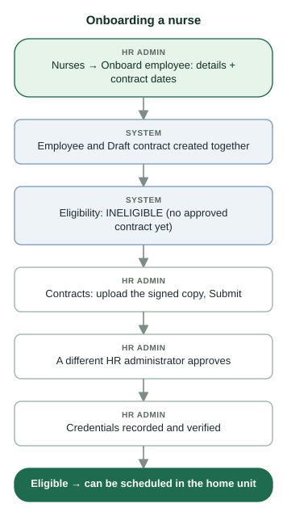

**Who can change which field**

| Field | Who changes it | Notes |
| :--- | :--- | :--- |
| First, middle, last name | HR / System Admin | Full name is built by the system, never typed |
| Job number | HR / System Admin | Unique (case does not matter); no format rule |
| Job title, file no., rank / grade, nationality, job post (city), actual work place, specialty, marital status, salary (SAR), hire date | HR / System Admin | Hidden from supervisors: salary, marital status, nationality, rank, file number, job post location, emergency contact |
| Unit | HR / System Admin | Moving a nurse re-checks eligibility and returns invalid future shifts to Draft |
| Position | HR Admin only (Change position) | Needs a reason; recorded from → to; a position never gives a login role |
| Contact e-mail | HR / System Admin | Used for the login invitation |
| Mobile and emergency contact phone | HR, and the employee on My Profile | International format, e.g. +966500000000 |

### 5.1 Find and open a nurse

**Status:** Implemented  
**Roles:** HR Admin, System Admin, Supervisor

**Purpose.** Look up a staff record.

**Who can perform it.** HR Admin, System Admin, Supervisor — only nurses in their scope.

**Steps.**

1. Open Nurses.
2. Type a job number or name in the search box and press Enter, or filter by unit.
3. Click the row to open the record on the right.

**System result.** Nothing changes. HR sees every field; supervisors see the baseline view.

**Approval.** None.

**Next step.** Contracts, Credentials or Eligibility for the same nurse.

**Common problems.**

- *The nurse is not listed* — The nurse is outside your scope, or the record was deleted. Ask HR.

**Related.** [Contracts](#6-contracts) · [Credentials](#7-credentials) · [Eligibility](#8-eligibility)

### 5.2 Onboard a new nurse

**Status:** Implemented  
**Roles:** HR Admin, System Admin

**Purpose.** Create the employee and the first contract in one step.

**Who can perform it.** HR Admin or System Admin, for a unit in scope (or Unassigned).

**Before you start.**

- Name, job number, contact e-mail; contract start and end dates.
- Unit and position if known — the defaults are Unassigned and SN.

**Steps.**

1. Open Nurses and click Onboard employee.
2. Fill in the details. The Hijri date is shown under each contract date.
3. Choose the unit (or leave Unassigned) and the position.
4. Click Submit.

**System result.** The employee and a Draft contract are created together (all or nothing), audited as high priority. Eligibility is INELIGIBLE until the contract is approved.

**Approval.** The contract must be approved by a different HR administrator (Contracts).

**Next step.** Contracts: upload the signed copy and Submit. Then record credentials.

**Common problems.**

- *The job number is refused as a duplicate* — Job numbers are unique regardless of case. Search for the existing record.
- *The form asks for a position* — The hospital has no active SN position to default to; choose one.

**Related.** [Contracts](#6-contracts) · [Credentials](#7-credentials) · [Eligibility](#8-eligibility)

### 5.3 Edit a staff record

**Status:** Implemented  
**Roles:** HR Admin, System Admin

**Purpose.** Correct or update employee details, or move a nurse to another unit.

**Who can perform it.** HR Admin or System Admin within scope.

**Steps.**

1. Open the nurse.
2. Click Edit at the top of the panel.
3. Change the fields and click Submit.

**System result.** Saved and audited. A unit change re-evaluates eligibility; future published shifts that are no longer valid return to Draft and the supervisors are told.

**Approval.** None.

**Next step.** Check Eligibility if the unit changed.

**Common problems.**

- *Phone refused* — Use the international format: + then country code and number, e.g. +966500000000.

**Related.** [Eligibility](#8-eligibility) · [Roster and scheduling](#11-roster-and-scheduling)

### 5.4 Change a nurse's position

**Status:** Implemented  
**Roles:** HR Admin

**Purpose.** Record a new position (for example SN → CN).

**Who can perform it.** HR Admin only (not System Admin).

**Steps.**

1. Open the nurse.
2. Click Change position.
3. Choose the position and write the reason.
4. Submit.

**System result.** Recorded from → to with the reason. Eligibility is re-evaluated (a non-schedulable position cannot be rostered).

**Approval.** None.

**Next step.** Requirements may differ by position: check Eligibility.

**Common problems.**

- *Refused* — The position is inactive or unchanged.

**Related.** [Workforce](#9-workforce) · [Eligibility](#8-eligibility)

### 5.5 Delete a staff record

**Status:** Implemented  
**Roles:** HR Admin, System Admin

**Purpose.** Remove a nurse who left, keeping the history.

**Who can perform it.** HR Admin or System Admin within scope; never on their own record.

**Steps.**

1. Open the nurse.
2. Click Delete.
3. Write the reason (at least 10 characters) and confirm.

**System result.** A soft delete: the record leaves the lists, history stays, eligibility becomes INELIGIBLE.

**Approval.** None.

**Next step.** Deactivate the login account in Nursing Administration → Accounts if there is one.

**Related.** [Nursing Administration](#14-nursing-administration)

### 5.6 Send a login invitation

**Status:** Implemented  
**Roles:** HR Admin, System Admin

**Purpose.** Let the nurse create their own login with a private link.

**Who can perform it.** HR Admin or System Admin within scope.

**Before you start.**

- E-mail switched on by the hospital.
- An Approved or Active contract.
- A valid contact e-mail on the record, not used by another account.

**Steps.**

1. Open the nurse.
2. Scroll to Login account.
3. Click Send invitation.

**System result.** A private link is e-mailed (valid 72 hours, works once). A new invitation cancels the previous link.

**Approval.** None.

**Next step.** The nurse creates the account (Getting started → Create your account from an invitation).

**Common problems.**

- *"E-mail is not configured"* — E-mail is switched off: create the account in Nursing Administration → Accounts instead.
- *"current approved or active contract"* — Approve the contract first.
- *"already has a login account" / "e-mail in use"* — Use Accounts to manage the existing login.

**Related.** [Getting started](#1-getting-started) · [Nursing Administration](#14-nursing-administration) · [Contracts](#6-contracts)

*Needs e-mail switched on, an Approved or Active contract and a valid contact e-mail on the staff record.*

## 6. Contracts

Employment contracts. A nurse is covered — and can be eligible — only on dates inside an Approved or Active contract. HR prepares a contract, attaches the signed copy and submits it; a different HR administrator approves it.

**Who:** HR Admin and System Admin (create, approve, change); Supervisor (reduced view); employees (their own)  
**Screen:** `/contracts`  
**Where:** Side menu → Contracts.

> **Important:** Nobody can create, renew, change or upload to their own contract, and nobody approves a contract they created or submitted.

> **Note:** Two Approved/Active periods of one nurse may never overlap. Every contract change re-evaluates the nurse's eligibility at once.

> **Important:** A renewal needs valid credentials. For a nurse who has had a contract before, a contract is neither created nor approved while a required credential of their unit and position is missing, expired, not yet verified, suspended or revoked. The ended contract itself does not count, so an expired contract can always be renewed once the credentials are in order. A nurse's first contract is not checked.

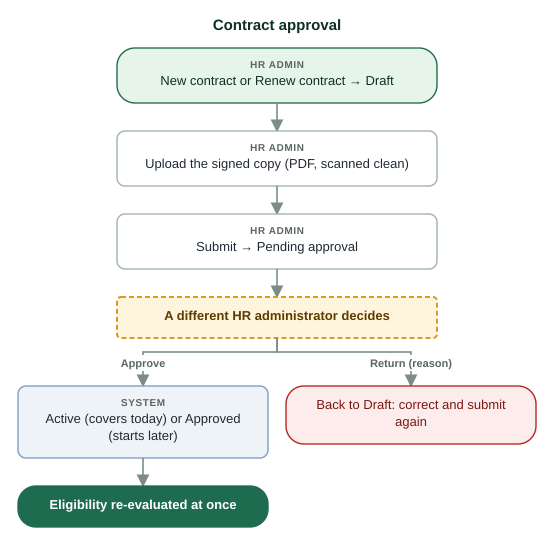

*The creator and the submitter can never approve. Only Approved and Active contracts cover a date. A renewal needs valid credentials (the ended contract itself does not count); a first contract is not checked.*

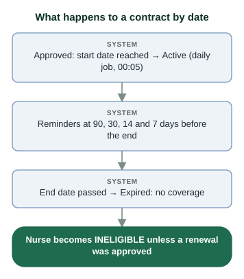

**Contract statuses**

| Status | Covers dates? | Meaning |
| :--- | :--- | :--- |
| Draft | No | Being prepared; can be submitted once the signed copy is uploaded |
| Pending approval | No | Submitted; waits for a different HR administrator |
| Approved | Yes, from its start date | Approved for a future period |
| Active | Yes | Approved and covering today |
| Suspended | No | Paused with a reason; can be reinstated |
| Terminated | No | Ended early; final |
| Expired | No | The end date passed (set by the daily job) |
| Superseded | No | Replaced; never set by hand |

**Actions and who may take them**

| Action | From | Result | Rule |
| :--- | :--- | :--- | :--- |
| Submit | Draft | Pending approval | A clean signed copy (PDF) must be uploaded |
| Return | Pending approval | Draft | Reason required |
| Approve | Pending approval | Active (covers today) or Approved | Not the person who created or submitted it |
| Suspend | Approved, Active | Suspended | Reason required |
| Reinstate | Suspended | Approved or Active by date | Reason required; overlap re-checked |
| Terminate | Approved, Active | Terminated (final) | Reason required |

### 6.1 Create a contract

**Status:** Implemented  
**Roles:** HR Admin, System Admin

**Purpose.** Give a nurse without a covering contract a new employment period.

**Who can perform it.** HR Admin or System Admin within scope.

**Before you start.**

- Start and end dates.
- The signed contract as a PDF.

**Steps.**

1. Open Contracts and click New contract.
2. Search the employee by job number or name (only nurses with no Approved/Active contract are offered).
3. Choose the start and end dates (the Hijri dates are shown).
4. Click Submit — the contract is saved as Draft.

**System result.** A Draft contract. It gives no coverage yet.

**Approval.** Approval by a different HR administrator comes after Submit.

**Next step.** Upload the signed copy, then Submit (next task).

**Common problems.**

- *The employee is not offered* — They already have an Approved or Active contract: use Renew contract.
- *"Renew or verify these credentials before renewing the contract"* — The nurse had a contract before, so this counts as a renewal: the credentials listed must be valid first (see Renew a contract).

**Related.** [Nurses](#5-nurses) · [Eligibility](#8-eligibility)

*The creator and the submitter can never approve. Only Approved and Active contracts cover a date. A renewal needs valid credentials (the ended contract itself does not count); a first contract is not checked.*

### 6.2 Renew a contract

**Status:** Implemented  
**Roles:** HR Admin, System Admin

**Purpose.** Prepare the next period so the nurse stays covered without a gap.

**Who can perform it.** HR Admin or System Admin within scope.

**Before you start.**

- Every required credential of the nurse's unit and position is valid: verified, in date, not suspended or revoked (a credential in its grace period, under a waiver or in a transition period also passes). Check Eligibility: only credential reasons matter here, not the contract reason.

**Steps.**

1. Open Contracts and click Renew contract.
2. Choose the employee: the current contract is shown and the dates are pre-filled (the day after the current end, same length).
3. Adjust the dates if needed and Submit.

**System result.** A new Draft contract for the next period. Refused with the list of credentials to renew or verify first if any required credential is not valid — checked again when the contract is approved.

**Approval.** After Submit, a different HR administrator approves.

**Next step.** Upload the copy and Submit. Once approved, the nurse gets no contract reminders for the old period.

**Common problems.**

- *A nurse is missing from the renewal list* — The list shows at most 500 employees in your scope; type to search.
- *"Renew or verify these credentials before renewing the contract: …"* — The nurse renews the listed credentials on My Credentials and HR verifies them (or approves the renewals); then renew the contract. A nurse with no unit is refused too, because no credential can be checked: assign the unit first.
- *Approve refused with the same message* — A credential expired or was suspended after the renewal was created. Bring it back in order, then approve.

**Related.** [Eligibility](#8-eligibility) · [Notifications](#13-notifications)

*The creator and the submitter can never approve. Only Approved and Active contracts cover a date. A renewal needs valid credentials (the ended contract itself does not count); a first contract is not checked.*

### 6.3 Upload the signed contract copy

**Status:** Implemented  
**Roles:** HR Admin, System Admin

**Purpose.** Attach the signed document; it is required before Submit.

**Who can perform it.** HR Admin or System Admin within scope (view: also the employee).

**Steps.**

1. On the contract row click Contract copy.
2. Click Upload signed copy and choose the PDF (at most 10 MB).
3. Wait until it is listed as CLEAN.

**System result.** A new version is stored encrypted; earlier versions are never overwritten. Files that fail the virus scan are refused.

**Approval.** None.

**Next step.** Submit the contract.

**Common problems.**

- *Upload refused* — Only PDF, at most 10 MB, and the file must pass the virus scan.

**Related.** [Credentials](#7-credentials)

### 6.4 Submit and approve a contract

**Status:** Implemented  
**Roles:** HR Admin, System Admin

**Purpose.** Move a Draft contract to Approved / Active so it covers the nurse.

**Who can perform it.** Submit: HR Admin or System Admin. Approve: a different HR person in scope.

**Steps.**

1. Person A: on the Draft row click Submit → Pending approval.
2. Person B (did not create or submit it): open the contract copy and check it.
3. Person B: click Approve — or Return with a reason to send it back to Draft.

**System result.** Approve: Active if it covers today, otherwise Approved. A message shows the new status and the nurse's eligibility.

**Approval.** This is the approval (not through the Approvals tab).

**Next step.** Credentials, then Eligibility.

**Common problems.**

- *"must be approved by a different HR administrator"* — You created or submitted it. Ask another HR administrator.
- *"Upload the signed contract copy"* — Upload the PDF and wait for CLEAN before Submit.
- *"period has already ended" / overlap* — Correct the dates: periods may not overlap and must not be in the past.

**Related.** [Eligibility](#8-eligibility) · [Approvals (four-eyes)](#3-approvals-four-eyes)

*The creator and the submitter can never approve. Only Approved and Active contracts cover a date. A renewal needs valid credentials (the ended contract itself does not count); a first contract is not checked.*

### 6.5 Suspend, reinstate or terminate a contract

**Status:** Implemented  
**Roles:** HR Admin, System Admin

**Purpose.** Stop coverage temporarily or for good.

**Who can perform it.** HR Admin or System Admin within scope.

**Steps.**

1. On the contract row click Suspend, Reinstate or Terminate.
2. Write the reason (at least 5 characters) and submit.

**System result.** Suspended and Terminated contracts cover nothing: the nurse becomes ineligible and invalid future shifts return to Draft. Reinstate restores Approved or Active by date.

**Approval.** None.

**Next step.** Tell the supervisor; re-staff affected shifts.

**Related.** [Roster and scheduling](#11-roster-and-scheduling) · [Eligibility](#8-eligibility)

## 7. Credentials

Licences, certificates and documents (SCFHS licence, BLS, ACLS, Iqama …) with their evidence. HR verifies them; the dates decide whether they count. The tabs also hold the review queue, the requirements per unit, and the hospital catalogue of credential types.

**Who:** HR Admin and System Admin (decisions, within scope); Supervisor (compliance view: no identity numbers, no documents)  
**Screen:** `/credentials`  
**Where:** Side menu → Credentials. Tabs: Records, Review queue (HR), Requirements, Catalog, Categories. Nurses use My Credentials.

> **Important:** Nobody verifies, approves, rejects, suspends or revokes their own credential.

> **Note:** Recording a credential for a nurse is done by the nurse on My Credentials. HR recording it on the nurse's behalf exists in the API but not yet on this screen.

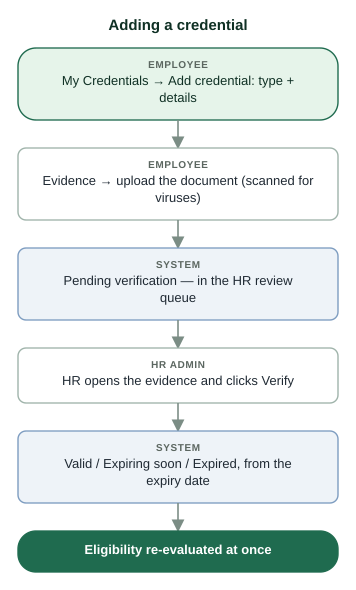

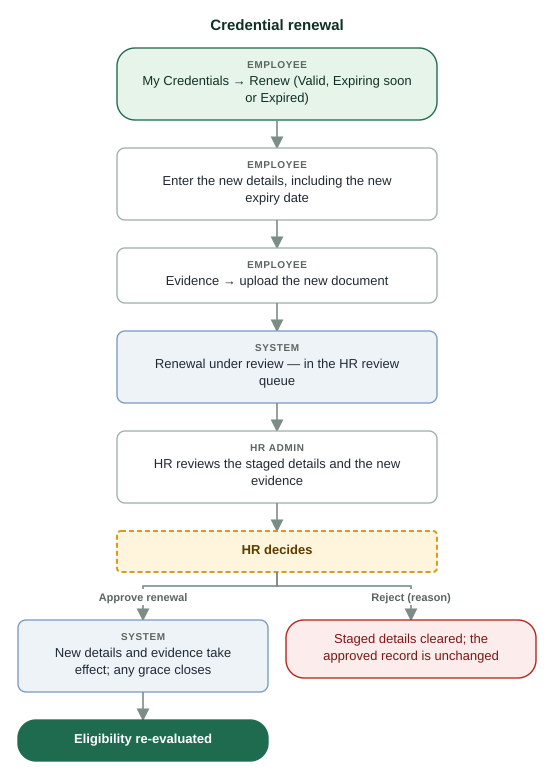

*The current credential stays usable until its own expiry while the renewal is reviewed.*

**Credential status (stored — decides eligibility)**

| Status | Counts for eligibility? | Meaning |
| :--- | :--- | :--- |
| Pending verification | No | Recorded, waiting for HR to verify |
| Valid | Yes | Verified; more than 60 days before expiry |
| Expiring soon | Yes | Verified; within 60 days of expiry |
| Expired | No (grace may apply) | The day after the expiry date |
| Suspended | No | Stopped by HR or by an SCFHS answer |
| Revoked | No — final | Cancelled for good |

**Lifecycle label (display only — never authorises anything)**

| Label | Shown when |
| :--- | :--- |
| Active | Current and not near expiry |
| Subject to renew | Within 60 days of expiry |
| Renewal under review | A renewal is waiting for HR |
| Expired | Past its expiry |

**Evidence (documents)**

| Rule | Detail |
| :--- | :--- |
| Files | PDF, JPEG, PNG or WebP, at most 10 MB; the content is checked, not just the name |
| Virus scan | Every file is scanned on upload; a file that fails is refused |
| Versions | Each upload is a new version; nothing is overwritten |
| Review status | Pending review → Approved (when HR verifies or approves a renewal) or Rejected |
| Who opens them | The holder and HR in scope. Supervisors never. Each view or download uses a single-use link valid 60 seconds |

### 7.1 A. Find and read credential records

**Status:** Implemented  
**Roles:** HR Admin, System Admin, Supervisor

**Purpose.** See each nurse's credentials, their status and dates.

**Who can perform it.** HR Admin, System Admin, Supervisor — nurses in scope (supervisors: compliance view).

**Steps.**

1. Open Credentials → Records. The list is sorted by expiry date (soonest first).
2. Read the Status tag, the lifecycle label, a gold "Grace until …" tag if grace is running, issue and expiry dates (with the Hijri expiry where recorded).
3. HR only: search by an identifier number (licence, Iqama …) with at least 3 characters. The search is recorded; the number itself is never stored or logged.

**System result.** Nothing changes.

**Approval.** None.

**Next step.** Review queue for work waiting; Eligibility for the effect.

**Common problems.**

- *No Evidence / SCFHS / Verify buttons* — You are a supervisor (compliance view), or the record is outside your HR scope.

**Related.** [Eligibility](#8-eligibility) · [Employee self-service](#16-employee-self-service)

### 7.2 Work the review queue

**Status:** Implemented  
**Roles:** HR Admin, System Admin

**Purpose.** See everything that waits for an HR decision.

**Who can perform it.** HR Admin and System Admin within scope.

**Steps.**

1. Open Credentials → Review queue.
2. It lists credentials Pending verification, renewals waiting, and documents pending review.
3. Work each row with Evidence, then Verify or Approve / Reject renewal.

**System result.** Each decision re-evaluates the nurse's eligibility at once.

**Approval.** None (your decision is the review).

**Next step.** Eligibility shows the new result.

**Related.** [Eligibility](#8-eligibility)

### 7.3 B. Open, review and upload evidence

**Status:** Implemented  
**Roles:** HR Admin, System Admin, Employee

**Purpose.** Check the document behind a credential, or add a newer one.

**Who can perform it.** HR Admin / System Admin in scope, and the holder. Never supervisors.

**Steps.**

1. Click Evidence on the credential row.
2. The versions are listed newest first with review status and scan status; "Current evidence" marks the approved one.
3. View or Download a CLEAN version (the link works once, for 60 seconds).
4. To add a version: Upload evidence and choose the file.

**System result.** An upload becomes a new version, Pending review. It is approved when HR verifies the credential or approves the renewal, and rejected otherwise.

**Approval.** HR review through Verify or the renewal decision.

**Next step.** Verify (new credential) or Approve renewal.

**Common problems.**

- *Upload refused* — PDF, JPEG, PNG or WebP, at most 10 MB; the file must pass the virus scan. A revoked credential takes no evidence.
- *No View / Download button* — Only CLEAN files can be opened, and only by the holder and HR.

**Related.** [Employee self-service](#16-employee-self-service)

### 7.4 C. Verify a credential

**Status:** Implemented  
**Roles:** HR Admin, System Admin

**Purpose.** Confirm that a recorded credential is genuine so that it counts.

**Who can perform it.** HR Admin or System Admin in scope; never your own.

**Before you start.**

- The expiry date must be recorded if the type expires.
- If the type requires evidence, a CLEAN document must be uploaded.

**Steps.**

1. Open the credential's Evidence and compare the document with the recorded details.
2. For SCFHS-checked types, look at the SCFHS checks too.
3. Click Verify.

**System result.** Status becomes Valid, Expiring soon or Expired — from the expiry date, not chosen by hand. The newest clean pending document becomes the current evidence. Eligibility is re-evaluated at once.

**Approval.** None — the verification is the approval.

**Next step.** Eligibility should now show the credential as met.

**Common problems.**

- *"requires evidence: upload a document first"* — Upload the document under Evidence, then Verify.
- *"record its expiry date before verifying"* — The holder records the expiry; HR cannot verify without it.
- *"You cannot review or decide on your own credential"* — Ask another HR administrator.

**Related.** [Eligibility](#8-eligibility)

### 7.5 D. Check a licence with SCFHS

**Status:** Implemented — Answers come from a simulated registry until the hospital has access to the SCFHS verification service; the screen says so.  
**Roles:** HR Admin, System Admin

**Purpose.** Compare the recorded licence with what the Saudi Commission for Health Specialties reports.

**Who can perform it.** HR Admin or System Admin in scope, for credential types set to "Check with SCFHS".

**Steps.**

1. On the credential row click SCFHS (shown only for SCFHS-checked types).
2. Click Check with SCFHS now.
3. Read the answer and the history: when, trigger (on submission, nightly, on demand), SCFHS answer, details, action taken.

**System result.** Matches: nothing to do. Differs or not found: HR is notified. Suspended / revoked by SCFHS: HR is notified, and if the type is set to "Suspend on adverse SCFHS status" the credential is suspended at once. Unreachable: logged — try later. SCFHS never overwrites the record.

**Approval.** None.

**Next step.** If it differs, check the evidence and correct the record (or suspend it). Revoking is always an HR decision.

**Common problems.**

- *No SCFHS button* — The credential type is not set to "Check with SCFHS" (Catalog).

**Related.** [Eligibility](#8-eligibility) · [Nursing Administration](#14-nursing-administration)

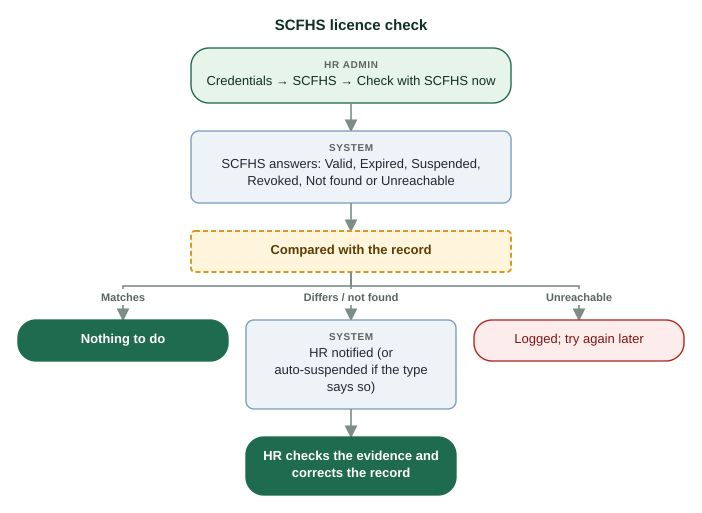

*For credential types set to "Check with SCFHS": on submission, nightly at 05:00, and on demand. SCFHS never overwrites the record.*

### 7.6 E. Renew a credential

**Status:** Implemented  
**Roles:** Employee, HR Admin, System Admin

**Purpose.** Replace a credential's details and document with the renewed ones, before or after expiry.

**Who can perform it.** The holder submits (My Credentials). HR Admin / System Admin in scope approves or rejects — never their own.

**Before you start.**

- The renewed details, including the new expiry date.
- The new document (PDF or image).

**Steps.**

1. Holder: My Credentials → Renew on the credential (offered when it is Valid, Expiring soon or Expired and no renewal is waiting).
2. Holder: enter the renewed details and Submit.
3. Holder: click Evidence and upload the new document.
4. The credential shows "Renewal under review"; the current one stays usable until its own expiry.
5. HR: Credentials → Review queue → Evidence to check the new document.
6. HR: Approve renewal — or Reject renewal with a reason.

**System result.** Approve: the new details and document take effect, the status follows the new expiry date, any grace period closes. Reject: the staged details and the pending document are cleared; the approved credential is unchanged and any grace ends at once. Eligibility is re-evaluated either way.

**Approval.** HR approval of the renewal (no second administrator).

**Next step.** Eligibility re-evaluates; the holder sees the result on My Credentials.

**Common problems.**

- *No Renew button* — The credential is Pending verification, Suspended or Revoked, or a renewal is already waiting.
- *"A renewal must state the new expiry date"* — Enter the new expiry date in the details.
- *Approve refused: evidence required* — The holder (or HR) uploads the new document first.

**Related.** [Eligibility](#8-eligibility) · [Notifications](#13-notifications) · [Roster and scheduling](#11-roster-and-scheduling) · [Employee self-service](#16-employee-self-service)

*The current credential stays usable until its own expiry while the renewal is reviewed.*

### 7.7 F. Suspend a credential

**Status:** Partially implemented — Suspending works. Lifting a suspension is not available in V04: the nurse records a new credential, which HR verifies.  
**Roles:** HR Admin, System Admin

**Purpose.** Stop a credential from counting at once (for example during an investigation).

**Who can perform it.** HR Admin or System Admin in scope; never their own. SCFHS can also suspend automatically for types set that way.

**Steps.**

1. On the credential row click Suspend.
2. Write the reason and submit.

**System result.** Status Suspended, audited as high priority; any grace ends. The nurse is INELIGIBLE wherever the credential is required, and future published shifts that are no longer valid return to Draft with the supervisors notified.

**Approval.** None.

**Next step.** Tell the supervisor; record a new credential when the matter is resolved.

**Related.** [Eligibility](#8-eligibility) · [Roster and scheduling](#11-roster-and-scheduling)

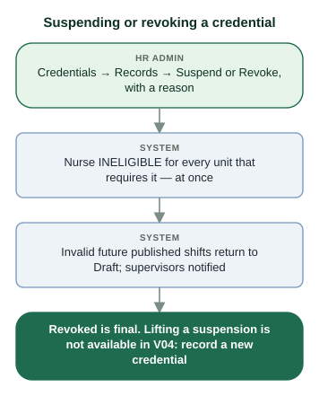

### 7.8 G. Revoke a credential

**Status:** Implemented  
**Roles:** HR Admin, System Admin

**Purpose.** Cancel a credential for good (for example a false document).

**Who can perform it.** HR Admin or System Admin in scope; never their own. Never automatic.

**Steps.**

1. On the credential row click Revoke.
2. Write the reason and submit.

**System result.** Status Revoked — final: it can never change, take evidence or be renewed. Same eligibility and roster effects as a suspension.

**Approval.** None.

**Next step.** A valid credential must be recorded as a new one.

**Related.** [Eligibility](#8-eligibility) · [Roster and scheduling](#11-roster-and-scheduling)

### 7.9 H. Configure credential requirements

**Status:** Implemented  
**Roles:** HR Admin, System Admin

**Purpose.** Say which credentials a unit (or a position in it) requires: Unit + optional Position + Credential type + Policy = Requirement.

**Who can perform it.** HR Admin or System Admin with the unit in scope. Supervisors read the requirements of their units.

**Before you start.**

- The hospital's decision on what the unit requires. The system does not define clinical policy.

**Steps.**

1. Credentials → Requirements → Add requirement.
2. Unit: the unit it applies to.
3. Position: one position, or leave blank for every position in the unit. A position-specific rule overrides the unit-wide one for the same type.
4. Credential: the type required.
5. Policy: MANDATORY (missing → ineligible), TRANSITION (warning until the deadline, then blocks — enter the deadline), or OPTIONAL (never affects eligibility).
6. Click Create.

**System result.** Applies at once: every affected nurse is re-evaluated in the same step; the message says how many. A new TRANSITION requirement notifies the nurses affected.

**Approval.** None.

**Next step.** Check Eligibility for the unit; nurses see what they are missing on My Credentials.

**Common problems.**

- *Need to change a requirement* — On screen: Delete it and add it again. (Editing in place exists in the API only.)

**Related.** [Eligibility](#8-eligibility) · [Workforce](#9-workforce)

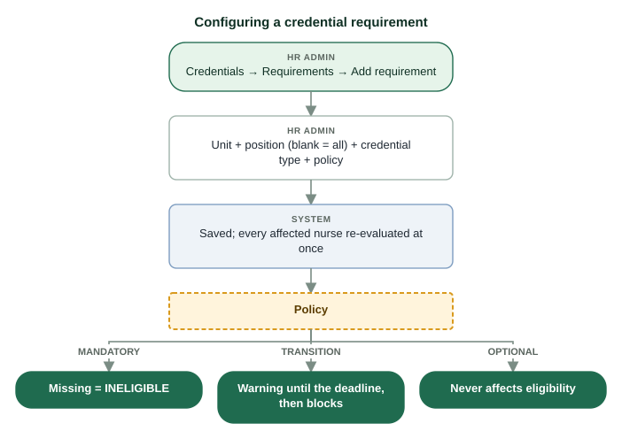

### 7.10 I. Manage credential categories

**Status:** Implemented  
**Roles:** HR Admin, System Admin

**Purpose.** Group credential types (licence, life support, training …).

**Who can perform it.** Hospital-wide HR Admin or System Admin; approved by another hospital-wide administrator.

**Steps.**

1. Credentials → Categories → Add category (or Edit).
2. Code (capitals, e.g. LIFE_SUPPORT), name, description, display order (lower comes first).
3. Reason — at least 10 characters.
4. Submit.

**System result.** "Submitted for approval — a second administrator must approve it (request #…)". Nothing changes until it is approved.

**Approval.** Four-eyes: a different hospital-wide administrator in Approvals.

**Next step.** Approvals.

**Related.** [Approvals (four-eyes)](#3-approvals-four-eyes)

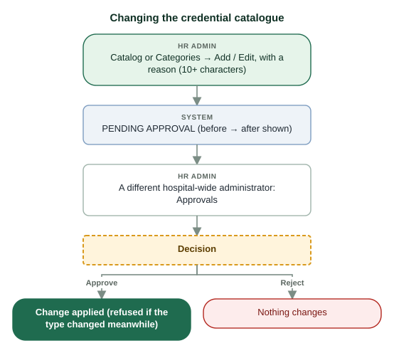

### 7.11 J. Manage the credential catalogue (types)

**Status:** Implemented  
**Roles:** HR Admin, System Admin

**Purpose.** Define a credential type: what is recorded, whether it expires, its grace period and SCFHS checking.

**Who can perform it.** Hospital-wide HR Admin or System Admin; approved by another hospital-wide administrator.

**Steps.**

1. Credentials → Catalog → Add credential type (or Edit).
2. Code, name, category, description.
3. Has an expiry date; Evidence upload required; Grace days (0–90); display order; Active.
4. Check with SCFHS (needs a field with the SCFHS registration data category) and, optionally, Suspend on adverse SCFHS status.
5. Fields: key, label, type, required; mark one date field as the Issue date and one as the Expiry date; mark identity numbers as sensitive (encrypted). Order them with ↑ ↓.
6. Reason — at least 10 characters. Submit.

**System result.** A request with the change shown before → after. Field changes affect new entries only; recorded values are kept.

**Approval.** Four-eyes: a different hospital-wide administrator approves in Approvals; refused if the type changed after the request.

**Next step.** Approvals; then Requirements can use the type.

**Common problems.**

- *Grace days* — Grace days are hospital policy (0 until set). Grace applies only when a renewal is in progress.

**Related.** [Approvals (four-eyes)](#3-approvals-four-eyes) · [Eligibility](#8-eligibility)

### 7.12 HR records a credential for a nurse

**Status:** Partially implemented — Available in the API (POST /credentials) but not on the Credentials screen yet.  
**Roles:** HR Admin, System Admin

**Purpose.** Enter a credential on the nurse's behalf.

**Who can perform it.** HR Admin or System Admin in scope.

**Steps.**

1. On screen today: ask the nurse to add it under My Credentials (or sign in with the nurse present).

**System result.** The credential starts as Pending verification.

**Approval.** HR verifies it.

**Next step.** Verify.

**Related.** [Employee self-service](#16-employee-self-service)

## 8. Eligibility

The workforce and clinical gate: for every nurse, whether they may work today and every reason why or why not. It is recalculated whenever a fact changes and every day; the roster checks it again for each shift date.

**Who:** HR Admin, System Admin, Supervisor (within scope); each nurse sees their own on My Credentials  
**Screen:** `/eligibility`  
**Where:** Side menu → Eligibility. Filter by outcome at the top; waivers are listed below.

> **Note:** Red reasons block, amber ones warn, grey ones are notes. Hover a reason to read its full message.

> **Important:** A unit with no requirements configured shows ELIGIBLE with a note: nothing was checked. That is a policy gap for HR to close, not a clean result.

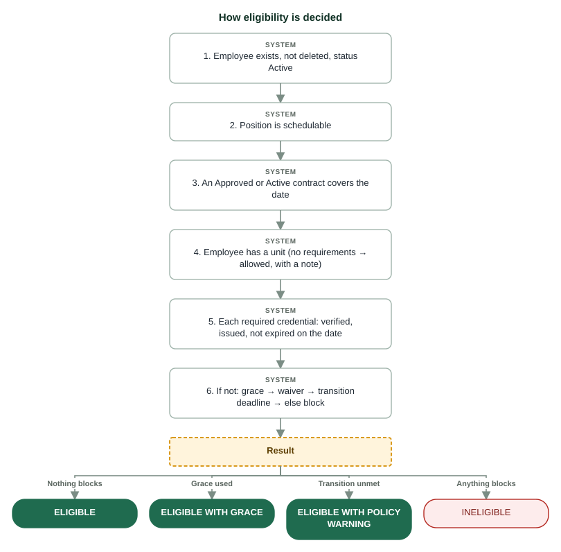

*Checked in this order for the date asked about. The first failures block; everything is listed as a reason.*

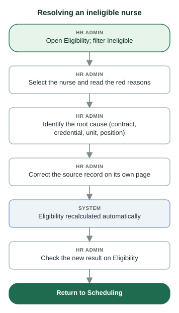

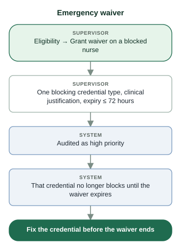

**Outcomes**

| Outcome | Meaning | Scheduling | What to do |
| :--- | :--- | :--- | :--- |
| ELIGIBLE | Nothing blocks | Can be rostered | Nothing |
| ELIGIBLE WITH GRACE | An expired credential is accepted in its grace window because a renewal is in progress | Can be rostered; reliance is recorded | HR decides the renewal before grace ends |
| ELIGIBLE WITH POLICY WARNING | A TRANSITION requirement is unmet before its deadline | Can be rostered until the deadline | Obtain the credential before the deadline |
| INELIGIBLE | At least one blocking reason | Cannot be published; stays Draft | Fix each red reason |

**Reasons and how to fix them**

| Reason code | Means | Fix it in |
| :--- | :--- | :--- |
| EMPLOYEE_NOT_FOUND / EMPLOYEE_DELETED | The record does not exist or was deleted | Nurses |
| EMPLOYEE_NOT_ACTIVE | The employee status is not Active | No screen changes the status in V04: tell the system administrator |
| POSITION_NOT_SCHEDULABLE | The position cannot be rostered (e.g. DON, DEPUTY_DON, ADMIN) | Nurses → Change position, or Workforce → Positions |
| NO_CONTRACT_COVERAGE | No Approved or Active contract covers the date | Contracts: approve, renew or reinstate |
| UNIT_NOT_ASSIGNED | The nurse has no unit, so no rules can be applied | Nurses → Edit → Unit |
| CREDENTIAL_MISSING | A required credential is not on record | My Credentials (nurse adds it), then Verify |
| CREDENTIAL_NOT_VERIFIED | Recorded but not verified | Credentials → Verify |
| CREDENTIAL_EXPIRED | Past its expiry (the expiry date is the last valid day) | Renewal |
| CREDENTIAL_NOT_YET_ISSUED | Issued after the date checked | Check the dates |
| CREDENTIAL_EXPIRY_UNKNOWN | An expiring type without an expiry date | Correct the record (renewal with the date) |
| CREDENTIAL_SUSPENDED / CREDENTIAL_REVOKED | Stopped by HR or SCFHS | Credentials (a new credential if needed) |
| POLICY_TRANSITION_WARNING (amber) | Transition requirement unmet; blocks after the deadline | Obtain the credential |
| GRACE_ACTIVE (amber) | Relying on a grace period | Decide the renewal |
| WAIVER_ACTIVE (grey) | An emergency waiver covers a credential | Fix before it expires |
| NO_REQUIREMENTS_CONFIGURED (grey) | The unit/position has no requirements: nothing was checked | Requirements (HR policy) |

### 8.1 Read a nurse's eligibility

**Status:** Implemented  
**Roles:** HR Admin, System Admin, Supervisor

**Purpose.** Know who may work and why not.

**Who can perform it.** HR Admin, System Admin, Supervisor (scope).

**Steps.**

1. Open Eligibility.
2. Filter: All, Ineligible, Eligible (grace), Eligible (policy warning), Eligible.
3. Read the reasons and "Calculated" — when and by which event.

**System result.** Nothing changes. The stored result is for today; the roster checks each shift date separately.

**Approval.** None.

**Next step.** Resolve ineligibility (next task) or go to Scheduling.

**Related.** [Roster and scheduling](#11-roster-and-scheduling)

*Checked in this order for the date asked about. The first failures block; everything is listed as a reason.*

### 8.2 Resolve an ineligible nurse

**Status:** Implemented  
**Roles:** HR Admin, System Admin, Supervisor

**Purpose.** Get a blocked nurse back to work by fixing the cause, not the symptom.

**Who can perform it.** HR Admin / System Admin fix records; supervisors read and ask HR.

**Steps.**

1. Open Eligibility and filter Ineligible.
2. Select the nurse and read each red reason.
3. Identify the root cause with the table above (contract, credential, unit or position).
4. Correct the source record on its own page — Contracts, Credentials, Nurses.
5. Eligibility recalculates automatically in the same step as your correction.
6. Check the new result on Eligibility.
7. Return to Scheduling.

**System result.** The stored eligibility changes with an audit entry; the next roster check uses it.

**Approval.** Whatever the correction needs (e.g. a contract approval by another HR person).

**Next step.** Scheduling.

**Related.** [Contracts](#6-contracts) · [Credentials](#7-credentials) · [Nurses](#5-nurses) · [Roster and scheduling](#11-roster-and-scheduling)

### 8.3 Grant an emergency waiver

**Status:** Implemented  
**Roles:** Supervisor, HR Admin

**Purpose.** In an emergency, let one blocking credential not count for a short time.

**Who can perform it.** Supervisor or HR Admin only (not System Admin, not break-glass); never for your own credential.

**Before you start.**

- A clinical justification.
- The waiver covers one credential type, for at most 72 hours.

**Steps.**

1. On Eligibility, click Grant waiver on the nurse (shown only when a credential blocks).
2. Choose the blocking credential.
3. Write the clinical justification and the expiry (≤ 72 hours).
4. Submit.

**System result.** Audited as high priority. That credential stops blocking until the waiver expires; the message shows the nurse's new eligibility. Shifts published in reliance on it are recorded.

**Approval.** None.

**Next step.** Fix the credential before the waiver ends; the waivers list shows active and expired ones.

**Common problems.**

- *No Grant waiver button* — Your role cannot waive, the block is not a credential (e.g. no contract), or it is your own record.

**Related.** [Roster and scheduling](#11-roster-and-scheduling) · [Credentials](#7-credentials)

## 9. Workforce

The hospital's structure: departments, units and their beds, positions, and how many staff each unit needs per shift. Everyone can read it; HR keeps it current. Eligibility, the roster and the KPIs all read from here.

**Who:** Everyone reads; HR Admin and System Admin change it (hospital-wide for structure, unit scope for beds and coverage)  
**Screen:** `/workforce`  
**Where:** Side menu → Workforce. Tabs: Units, Departments, Positions, Coverage targets.

> **Note:** A coverage target left empty means "not set" — never zero. Shortages warn but never stop publication. Rest, fatigue and skill-mix rules are not defined by the hospital yet and are not enforced.

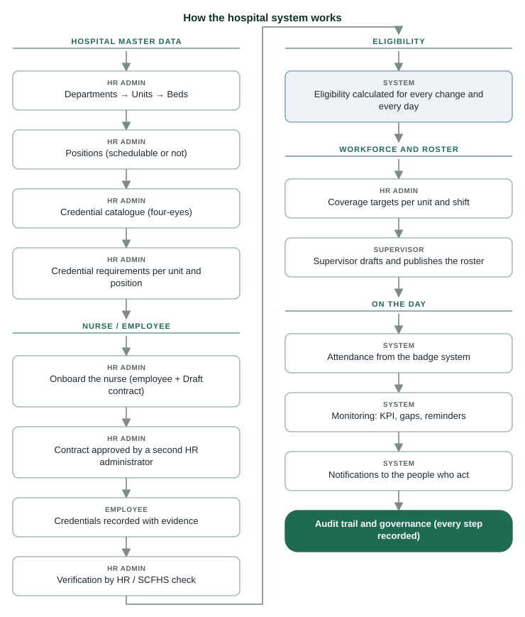

*Master data is set up once and kept current; each nurse then moves from contract to credentials to eligibility, and only eligible nurses reach the roster.*

**How workforce data feeds the rest**

| Item | Used by |
| :--- | :--- |
| Units (and the nurse's unit) | Requirements, eligibility, scopes, the roster (a nurse works only in the home unit) |
| Positions (schedulable or not) | Eligibility (non-schedulable positions cannot be rostered), requirements per position |
| Beds | Hospital total and the nurse-to-bed KPIs |
| Critical area (ICU / ER / OR) | Which units count towards KPI A |
| Coverage targets | Roster board (eligible / target, shortage), auto-fill |

### 9.1 Add or edit a unit

**Status:** Implemented  
**Roles:** HR Admin, System Admin

**Purpose.** Keep the list of wards and services correct.

**Who can perform it.** Hospital-wide HR Admin or System Admin.

**Steps.**

1. Workforce → Units → Add unit (or Edit on a row).
2. Code (unique), name, department, description; critical area ICU / ER / OR only for those units.
3. New unit: initial beds. Existing unit: Active on/off.
4. Submit.

**System result.** Saved and audited. The hospital total is recalculated live.

**Approval.** None.

**Next step.** Coverage targets and Requirements for the unit.

**Common problems.**

- *Cannot deactivate* — The unit still has active employees; move them first.

**Related.** [Credentials](#7-credentials) · [Nursing KPIs](#10-nursing-kpis)

### 9.2 Change a unit's beds and read the bed history

**Status:** Implemented  
**Roles:** HR Admin, System Admin, Supervisor

**Purpose.** Record the current bed capacity, with the reason, so the KPIs stay true.

**Who can perform it.** HR Admin or System Admin with the unit in scope. The history: also supervisors.

**Steps.**

1. Workforce → Units → Change beds on the row.
2. New count (0–500) and a reason.
3. Submit. History shows every change: when, before → after, reason, by whom.

**System result.** One history row per change; the history is never edited, which is why it can be trusted in an audit.

**Approval.** None.

**Next step.** Nursing KPIs use the new count.

**Related.** [Nursing KPIs](#10-nursing-kpis)

### 9.3 Import units from a CSV file

**Status:** Implemented  
**Roles:** HR Admin, System Admin

**Purpose.** Create or update many units at once.

**Who can perform it.** Hospital-wide HR Admin or System Admin.

**Steps.**

1. Workforce → Units → Import CSV.
2. Choose the file or paste it: unit_code, name, department_code, beds, description.
3. Preview: rows created, updated, unchanged, rejected (with reasons).
4. Apply.

**System result.** Applied rows are saved; the import never deletes or deactivates a unit. At most 500 rows.

**Approval.** None.

**Next step.** Check the units list.

### 9.4 Add or edit a department

**Status:** Implemented  
**Roles:** HR Admin, System Admin

**Purpose.** Group units into departments (a department scope covers all its units).

**Who can perform it.** Hospital-wide HR Admin or System Admin.

**Steps.**

1. Workforce → Departments → Add department (or Edit).
2. Code, name, description; Active on/off for existing ones.
3. Submit.

**System result.** Saved and audited.

**Approval.** None.

**Next step.** Assign units to it.

**Common problems.**

- *Cannot deactivate* — It still has active units.

**Related.** [Roles and permissions](#2-roles-and-permissions)

### 9.5 Manage positions

**Status:** Implemented  
**Roles:** HR Admin, System Admin

**Purpose.** Keep the list of position codes (SN, CN, HN …) and whether each can be rostered.

**Who can perform it.** Hospital-wide HR Admin or System Admin.

**Steps.**

1. Workforce → Positions → Add position (or Edit).
2. Code, title, tier, description, display order, Schedulable, Active.
3. Submit.

**System result.** Changing Schedulable re-evaluates everyone in the position. Deprecated positions show "→ replacement".

**Approval.** None.

**Next step.** Eligibility for holders of the position.

**Common problems.**

- *Cannot deactivate* — Active employees still hold it; change their positions first.

**Related.** [Nurses](#5-nurses) · [Eligibility](#8-eligibility)

### 9.6 Set coverage targets

**Status:** Implemented  
**Roles:** HR Admin, System Admin

**Purpose.** Set the minimum staff each unit needs per shift (Morning 07–15, Evening 15–23, Night 23–07).

**Who can perform it.** HR Admin or System Admin with the unit in scope.

**Steps.**

1. Workforce → Coverage targets.
2. Type the number in the unit's shift cell; it saves when you leave the cell.
3. Clear a cell to make it "not set".

**System result.** The roster board measures each shift against it; auto-fill fills up to it.

**Approval.** None.

**Next step.** Scheduling.

**Related.** [Roster and scheduling](#11-roster-and-scheduling) · [Nursing KPIs](#10-nursing-kpis)

## 10. Nursing KPIs

Nurse-to-bed indicators for a date and shift. KPI A rates the ICU, ER and OR critical areas and averages them; KPI B is hospital-wide. Nurses = published roster assignments on that date and shift; beds = active units.

**Who:** HR Admin, System Admin, Supervisor  
**Screen:** `/kpi`  
**Where:** Side menu → Nursing KPIs.

> **Important:** The band thresholds (Standard, Distress, Failing, Failed) are V03's reading of the MoH Ada'a indicator card, which is not in the repository. The page says so: treat the bands as indicative until the source is confirmed.

### 10.1 Read the nurse-to-bed KPIs

**Status:** Implemented  
**Roles:** HR Admin, System Admin, Supervisor

**Purpose.** See staffing against beds for a shift.

**Who can perform it.** HR Admin, System Admin, Supervisor.

**Steps.**

1. Open Nursing KPIs.
2. Choose the date and the shift.
3. KPI A: each critical area with ratio, nurses on duty, beds and code (1–4), and the average band. KPI B: the hospital ratio and band.

**System result.** Nothing changes. Only published shifts count — drafts do not.

**Approval.** None.

**Next step.** Low staffing: Scheduling. Wrong beds or critical areas: Workforce.

**Related.** [Workforce](#9-workforce) · [Roster and scheduling](#11-roster-and-scheduling)

## 11. Roster and scheduling

The weekly roster board of a unit. Supervisors draft shifts from the nurses who are eligible on each date, check coverage, and publish. Eligibility is checked live for every shift date and again at publication. Employees see their own shifts and their home unit's published schedule.

**Who:** Supervisor (draft and publish their units); HR Admin and System Admin (read); employees (own shifts)  
**Screen:** `/scheduling`  
**Where:** Side menu → Roster & Scheduling. Choose a unit and a week.

> **Note:** A nurse is scheduled only in their home unit, and only once per date and shift across all units. Past dates cannot be drafted or published.

> **Important:** Auto-fill is a helper, not policy: rest, fatigue and overtime rules are not defined by the hospital and are not checked.

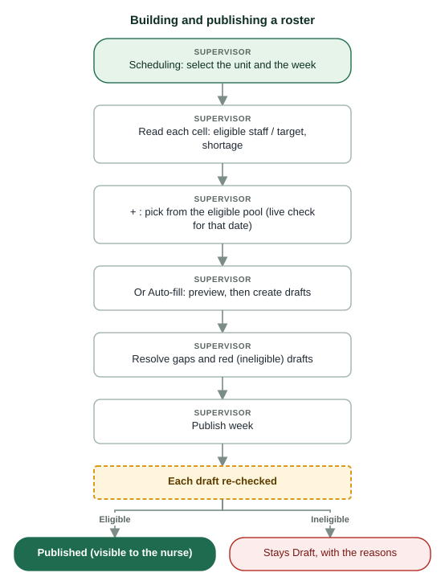

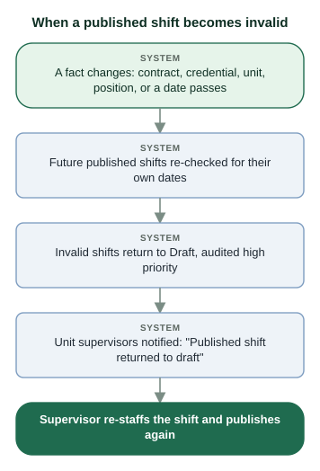

**Reading the board**

| You see | Meaning |
| :--- | :--- |
| 3/4 in a cell | Eligible published staff / coverage target |
| Target not set | No coverage target for that unit and shift |
| Orange −1 | Published shortage against the target |
| N drafts | Drafts not yet published |
| Dashed tag | A draft; solid = published |
| Tag colour | Green eligible, gold grace, orange policy warning, red ineligible — hover for reasons |

### 11.1 Add a nurse to a shift (draft)

**Status:** Implemented  
**Roles:** Supervisor

**Purpose.** Put an eligible nurse on a shift.

**Who can perform it.** Supervisor of the unit.

**Steps.**

1. Open Roster & Scheduling, choose the unit and the week (‹ › move by a week).
2. Click + in the cell (date × shift).
3. The pool lists the unit's nurses with their eligibility for that date and any shifts that day.
4. Click Assign.

**System result.** A Draft assignment; the message shows the nurse's eligibility for the date.

**Approval.** None.

**Next step.** Publish the week.

**Common problems.**

- *A nurse is missing from the pool* — Another unit is their home unit, or they are deleted.
- *Refused: already on a shift* — One assignment per nurse per date and shift.

**Related.** [Eligibility](#8-eligibility)

### 11.2 Auto-fill the week

**Status:** Implemented  
**Roles:** Supervisor

**Purpose.** Propose drafts up to each shift's coverage target.

**Who can perform it.** Supervisor of the unit.

**Steps.**

1. Choose the unit and week, click Auto-fill.
2. Read the proposal: proposed assignments, unfilled shifts, shifts without a target (not filled).
3. Click Create drafts — or Cancel.

**System result.** Drafts only — eligible nurses from the unit, fewest shifts first, at most one auto-filled shift per nurse per day.

**Approval.** None.

**Next step.** Review the drafts and publish.

**Related.** [Workforce](#9-workforce)

### 11.3 Publish the roster

**Status:** Implemented  
**Roles:** Supervisor

**Purpose.** Make the week's drafts official so nurses see them.

**Who can perform it.** Supervisor of the unit.

**Steps.**

1. Resolve red (ineligible) drafts and gaps.
2. Click Publish week.
3. Read the result: how many were published, which were blocked and why, and how many rely on a grace period or waiver.

**System result.** In one step every draft is re-checked for its date: eligible ones are Published; ineligible ones stay Draft with the reasons. Grace or waiver reliance is recorded and audited. Shortages warn but never block.

**Approval.** None.

**Next step.** Attendance on the day.

**Common problems.**

- *Some drafts stayed Draft* — Those nurses are ineligible on that date: see the reasons, fix them or choose someone else.

**Related.** [Eligibility](#8-eligibility) · [Attendance](#12-attendance)

### 11.4 Remove a draft or cancel a published shift

**Status:** Implemented  
**Roles:** Supervisor

**Purpose.** Take a nurse off a shift.

**Who can perform it.** Supervisor of the unit.

**Steps.**

1. Click the nurse's tag in the cell.
2. Draft: confirm removal. Published: give the reason, then confirm.

**System result.** Removed (draft) or Cancelled (published, with the reason). Audited.

**Approval.** None.

**Next step.** Re-staff the shift.

### 11.5 Handle a shift that returned to draft

**Status:** Implemented  
**Roles:** Supervisor

**Purpose.** React when a published nurse stops being eligible.

**Who can perform it.** Supervisor of the unit (notified automatically).

**Steps.**

1. Open the notice "Published shift returned to draft".
2. Open the week on the board: the shift shows as a red draft.
3. Assign another eligible nurse, or wait for the fix (e.g. a renewal approval) and publish again.

**System result.** The roster is valid again once republished.

**Approval.** None.

**Next step.** Notifications.

**Related.** [Notifications](#13-notifications) · [Eligibility](#8-eligibility)

### 11.6 See your own shifts

**Status:** Implemented  
**Roles:** Employee

**Purpose.** Know when you work.

**Who can perform it.** Every employee.

**Steps.**

1. Open Roster & Scheduling.
2. My shifts: the next 4 weeks. Below: your home unit's published schedule.

**System result.** Read only; only published shifts are shown.

**Approval.** None.

**Next step.** —

**Related.** [Employee self-service](#16-employee-self-service)

## 12. Attendance

Planned versus actual: for a unit and date, every published shift with its clock-in and a status. Clock events come from the hospital badge system; nothing is clocked by hand.

**Who:** HR Admin, System Admin, Supervisor (unit view); employees (own clock events)  
**Screen:** `/attendance`  
**Where:** Side menu → Attendance. Choose the unit and the date.

> **Note:** The badge-system interface is built (the badge system signs in as an API client), but the hospital's badge system is not connected yet, so the live server receives no clock events. The Badge simulator (System Admin) is switched off on the live server; it works only where the server setting BADGE_SIMULATOR is on. Manual clocking is not part of V04.

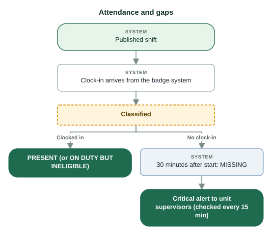

**Statuses**

| Status | When | Do |
| :--- | :--- | :--- |
| Upcoming | The shift has not started | — |
| Waiting | Started less than 30 minutes ago, no clock-in yet | Wait |
| Present | Clocked in from 30 minutes before the start | — |
| Missing | No clock-in and 30 minutes have passed since the start | Call the nurse; re-staff; a critical alert went to the unit supervisors |
| On duty but ineligible | Clocked in, but the nurse is ineligible today | Supervisor and HR act at once: read Eligibility, fix or relieve the nurse |

### 12.1 Check attendance gaps

**Status:** Partially implemented — The gap view and alerts work; real clock events wait for the hospital badge system to be connected.  
**Roles:** Supervisor, HR Admin, System Admin

**Purpose.** Find missing or ineligible nurses on shift.

**Who can perform it.** Supervisor, HR Admin, System Admin (scope).

**Steps.**

1. Open Attendance.
2. Choose the unit and date.
3. Read each shift: times, clock-in, status and reasons.

**System result.** Nothing changes. The alert job (every 15 minutes) sends one critical notice per missing assignment to the unit's supervisors.

**Approval.** None.

**Next step.** Missing: re-staff in Scheduling. On duty but ineligible: Eligibility.

**Related.** [Roster and scheduling](#11-roster-and-scheduling) · [Eligibility](#8-eligibility) · [Notifications](#13-notifications)

### 12.2 See your own clock events

**Status:** Implemented  
**Roles:** Employee

**Purpose.** Check what the badge system recorded for you.

**Who can perform it.** Every employee.

**Steps.**

1. Open Attendance: the last 30 days of your clock events (time, event, source).

**System result.** Read only.

**Approval.** None.

**Next step.** A wrong event: tell your supervisor (corrections are not in V04).

**Related.** [Employee self-service](#16-employee-self-service)

## 13. Notifications

Your action queue: each notice tells you something needs you — a credential or contract nearing its end, a shift returned to draft, a missing nurse, a request to answer. The bell at the top shows how many are unread.

**Who:** Everyone (own notices only)  
**Screen:** `/notifications`  
**Where:** The bell at the top, or Side menu → Notifications.

> **Note:** Each notice is in the app; when the hospital's e-mail is on, a copy goes to your e-mail too, and a short Telegram message ("something is waiting", never the details) if you linked Telegram. Approval requests are not sent as notifications: check Approvals.

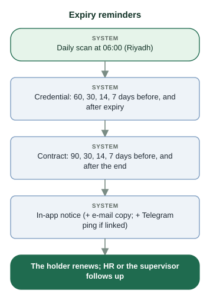

**Notices the system sends**

| Notice | Who receives it | Do |
| :--- | :--- | :--- |
| Credential expiring soon / Credential expired | Holder; then supervisor and HR as it gets closer | Renew (My Credentials); HR decides the renewal |
| Contract ending soon / Contract ended | Employee and HR; supervisor from 14 days | HR renews the contract |
| Renewal Required — Grace Period Active / Grace period in use | Holder / HR in scope, when grace is first used | Decide the renewal before grace ends |
| Grace period ended without renewal | HR in scope | The nurse is ineligible now: renew or re-staff |
| New credential requirement | Nurses affected by a new transition requirement | Obtain the credential before the deadline |
| Published shift returned to draft | Unit supervisors | Re-staff the shift |
| Critical coverage alert: not clocked in / ineligible nurse on duty | Unit supervisors | Call the nurse; re-staff; check Eligibility |
| SCFHS: <credential> of <nurse> | HR in scope | Check the record against SCFHS |
| Personal data request | HR | Work it in Data protection |
| Break-glass account activated | The recipients configured for break-glass alerts | Verify the emergency |
| Eligibility drift corrected; Document storage problem | System administrators | Review Background jobs |

### 13.1 Read and clear notifications

**Status:** Implemented  
**Roles:** Employee, Supervisor, HR Admin, System Admin

**Purpose.** Work through what needs you.

**Who can perform it.** Everyone.

**Steps.**

1. Click the bell or open Notifications. Unread is shown first; switch to All for history.
2. Read the priority (Critical, High, Medium, Low), title and message (Arabic when the page is in Arabic).
3. Act on it, then Mark read — or Mark all read.

**System result.** Read notices leave the unread count; they stay in All.

**Approval.** None.

**Next step.** The page the notice is about.

**Related.** [Credentials](#7-credentials) · [Contracts](#6-contracts) · [Roster and scheduling](#11-roster-and-scheduling)

## 14. Nursing Administration

Accounts, roles, approvals, hospital set-up, data protection and system tools. HR Admins see the people and data tabs; System Admins also see the system tabs, and the people tabs only while elevated.

**Who:** HR Admin and System Admin  
**Screen:** `/admin`  
**Where:** Side menu → Nursing Administration.

> **Important:** Nobody manages their own account, grants or revokes their own role, or decides their own request. The break-glass account is managed outside the application.

> **Note:** Telegram inbox, SCFHS registry and Badge simulator are demonstration tools: they hold synthetic data only and stand in for systems the hospital has not connected yet. On the live server the SCFHS registry and the Telegram inbox are in use; the Badge simulator is switched off.

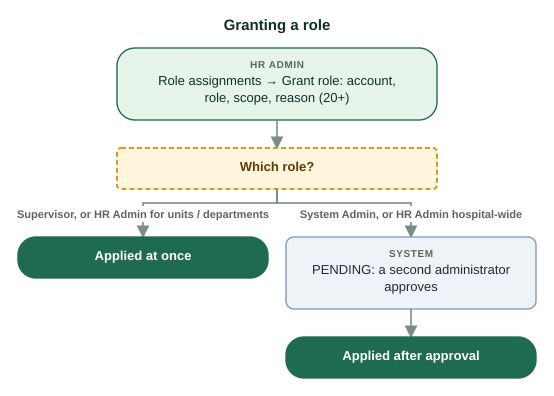

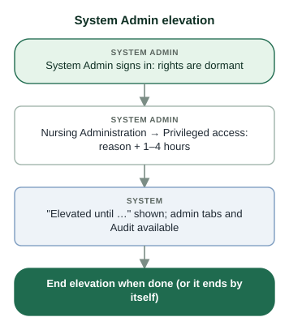

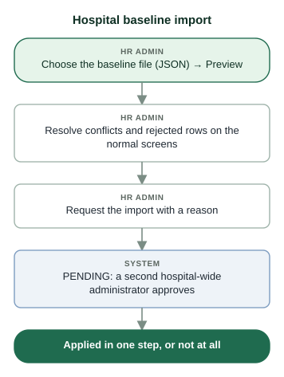

**The tabs**

| Tab | Purpose | Who | Changes need | Audited |
| :--- | :--- | :--- | :--- | :--- |
| Accounts | Logins: create, reset, deactivate, link to a staff record | HR Admin; System Admin (elevated) | — | Yes |
| Role assignments | Grant and revoke Supervisor / HR Admin / System Admin | HR Admin; System Admin (elevated) | Second admin for System Admin and hospital-wide HR Admin | Yes |
| Approvals | Decide protected changes | HR Admin; System Admin (elevated) | A different administrator | Yes |
| Hospital baseline import | Load departments, units, beds, positions, credential categories and types from a file | Hospital-wide HR Admin; System Admin (elevated) | Second hospital-wide admin | Yes |
| Data protection | Personal-data requests; the processing register and its sign-off | HR Admin; System Admin (elevated) | Erasure: a System Admin | Yes (register changes: high priority) |
| Eligibility logic | Shadow mode for a new version of the eligibility rules | Read: HR, System Admin; decide: hospital-wide HR Admin | — | Yes |
| Privileged access | Elevate System Admin rights for 1–4 hours | System Admin | A reason | Yes |
| Background jobs | Schedules, last runs, run now; business health | System Admin | — | Yes |
| Telegram inbox | Messages the simulated Telegram gateway kept; test messages | System Admin | — | — |
| SCFHS registry | The simulated SCFHS answers used until real SCFHS access | System Admin | — | Yes |
| Badge simulator | Simulated clock events for demonstrations; off on the live server (setting BADGE_SIMULATOR) | System Admin | — | Yes |
| API clients | Other systems allowed to call the API (FHIR reads, badge events) | System Admin | — | Yes |
| Access matrix | Who may do what, by area (read only) | Everyone in Administration | — | — |

### 14.1 Create a login account

**Status:** Implemented  
**Roles:** HR Admin, System Admin

**Purpose.** Give someone a login without e-mail (or for a person with no staff record).

**Who can perform it.** HR Admin; System Admin while elevated. An account without a staff link needs hospital-wide scope.

**Steps.**

1. Accounts → New account.
2. E-mail (the sign-in name), display name, a first password (12–72 characters).
3. Employee id (optional) links the login to a staff record, which gives the self-service pages.
4. Create. Give the password to the person in person or by phone, never in the same message as the e-mail.

**System result.** The account exists with no extra role; audited.

**Approval.** None.

**Next step.** Role assignments if the person needs a role. Supervisor and HR roles must set up two-factor sign-in at first sign-in.

**Related.** [Roles and permissions](#2-roles-and-permissions) · [Nurses](#5-nurses)

### 14.2 Reset, change e-mail, reset two-factor, deactivate

**Status:** Implemented  
**Roles:** HR Admin, System Admin

**Purpose.** Help a user who is locked out or has changed details.

**Who can perform it.** HR Admin; System Admin while elevated. Not on your own account, never on break-glass.

**Before you start.**

- Confirm who is asking before any of these.

**Steps.**

1. Send reset link: a link to the account's own e-mail, valid 24 hours.
2. Change e-mail: a confirmation link goes to the new address (valid 30 minutes); nothing changes until the person opens it; the old address is told.
3. Reset two-factor: removes the authenticator and signs the account out; a new one is set up at next sign-in.
4. Telegram link: shows a QR code the person scans to connect Telegram (15 minutes, single use).
5. Deactivate / Activate: blocks or restores sign-in.

**System result.** Each action is audited.

**Approval.** None.

**Next step.** —

**Common problems.**

- *Deactivate refused* — It would leave no usable System Admin.

**Related.** [Security and your account](#17-security-and-your-account)

### 14.3 Grant or revoke a role

**Status:** Implemented  
**Roles:** HR Admin, System Admin

**Purpose.** Give or remove Supervisor, HR Admin or System Admin rights within a scope.

**Who can perform it.** HR Admin or System Admin (elevated), covering the scope granted; never on their own account.

**Steps.**

1. Role assignments → Grant role.
2. Account, role, scope type (Units, Departments, System-wide) and the units or departments.
3. Reason — a real sentence of 20+ characters (it is kept in the audit trail).
4. Expiry (optional): Supervisor at most 90 days, others at most 365.
5. Submit. To revoke: Revoke on the row, reason of 10+ characters.

**System result.** Supervisor, or HR Admin for units / departments: applied at once. System Admin, or HR Admin hospital-wide: "Submitted for approval — a second administrator must approve it".

**Approval.** Four-eyes for System Admin and hospital-wide HR Admin.

**Next step.** Approvals (for the protected ones).

**Common problems.**

- *"already holds an active assignment for this role and scope type"* — One active row per person, role and scope type. To change the units: Revoke the row, then Grant again.
- *Cannot revoke the last System Admin* — Grant another System Admin first.

**Related.** [Approvals (four-eyes)](#3-approvals-four-eyes) · [Roles and permissions](#2-roles-and-permissions)

### 14.4 Import the hospital baseline

**Status:** Implemented  
**Roles:** HR Admin, System Admin

**Purpose.** Load the hospital's set-up in one step from a baseline file.

**Who can perform it.** Hospital-wide HR Admin or System Admin (elevated); approved by another hospital-wide administrator.

**Steps.**

1. Hospital baseline import → Choose file (JSON) → Preview.
2. Rows: Create, Unchanged, Conflict, Rejected — with totals of beds and credential fields.
3. Conflicts and rejected rows are fixed on the normal screens, never by the import.
4. Write the reason (10+ characters) and Request import.

**System result.** A pending request. When approved, it is applied in one step or not at all.

**Approval.** Four-eyes.

**Next step.** Approvals.

**Related.** [Workforce](#9-workforce) · [Credentials](#7-credentials) · [Approvals (four-eyes)](#3-approvals-four-eyes)

### 14.5 Answer personal-data requests

**Status:** Implemented  
**Roles:** HR Admin, System Admin

**Purpose.** Handle an employee's request to see, export, correct or erase their personal data (PDPL).

**Who can perform it.** HR Admin or System Admin (elevated) within scope; not your own request. Erasure: a System Admin other than whoever logged it.

**Steps.**

1. Data protection → Personal data requests (open ones shown; filter by type).
2. Log request: record one received on paper or by e-mail.
3. Start review, then Approve: access / portability → the package is downloadable for 30 days; correction → correct the record, then Complete with what changed.
4. Decline with a reason (10+ characters) when it cannot be granted.
5. Erasure (System Admin): read the warning, type the employee's job number, Erase.

**System result.** Each step is audited; the employee follows the status on My data. The answer is due within 30 days (shown as Due).

**Approval.** Erasure needs a System Admin.

**Next step.** —

**Related.** [Employee self-service](#16-employee-self-service)

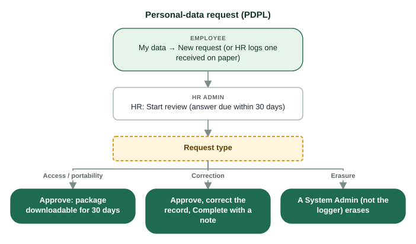

### 14.6 Maintain the processing register

**Status:** Implemented  
**Roles:** System Admin, HR Admin

**Purpose.** Record the lawful basis, purpose and retention for each kind of sensitive data.

**Who can perform it.** Edit: System Admin (elevated). Sign-off: HR Admin or System Admin acting for the Data Protection Officer.

**Steps.**

1. Data protection → Edit an entry: purpose, retention, active, reason (10+).
2. Sign-off: Record sign-off with title and note, confirm — once a year or after a change.

**System result.** Audited as high priority. A data kind without an active entry cannot be recorded at all.

**Approval.** None.

**Next step.** —

### 14.7 Review a new version of the eligibility rules

**Status:** Implemented  
**Roles:** HR Admin

**Purpose.** Check that new eligibility logic judges nurses correctly before it takes over.

**Who can perform it.** Hospital-wide HR Admin decides; HR and System Admin read.

**Steps.**

1. Eligibility logic: the active and the shadow version.
2. For each nurse the new version would judge differently: New logic is right, or Reject, with a note (10+).
3. Promote when allowed (7 days without disagreement, or every finding approved) — or Retire.

**System result.** The shadow version never changes a result. Promotion recalculates every nurse at once; audited.

**Approval.** None beyond the HR decision.

**Next step.** Eligibility.

**Related.** [Eligibility](#8-eligibility)

### 14.8 Elevate System Admin rights

**Status:** Implemented  
**Roles:** System Admin

**Purpose.** Switch on dormant System Admin rights for a documented task.

**Who can perform it.** System Admin.

**Steps.**

1. Privileged access: reason (10+ characters) and hours (1–4).
2. Elevate. An orange "Elevated until …" tag appears at the top.
3. End elevation when finished.

**System result.** Admin tabs and Audit & Compliance work until the time ends. Audited with the reason.

**Approval.** None.

**Next step.** The task you elevated for.

**Related.** [Security and your account](#17-security-and-your-account) · [Audit & Compliance](#15-audit--compliance)

### 14.9 Check background jobs and business health

**Status:** Implemented  
**Roles:** System Admin

**Purpose.** See that the scheduled work runs (expiry scan, daily transitions, SCFHS sync, attendance alerts …).

**Who can perform it.** System Admin.

**Steps.**

1. Background jobs: business health (eligibility drift, e-mail and Telegram delivery) and each job's schedule and last runs.
2. Run now to repeat a job (it is safe: each run is keyed to its period).

**System result.** A run is recorded with its result.

**Approval.** None.

**Next step.** —

**Related.** [Troubleshooting](#19-troubleshooting)

### 14.10 Register an API client

**Status:** Implemented  
**Roles:** System Admin

**Purpose.** Let another system (HIS, payroll, the badge system) call the API without a person.

**Who can perform it.** System Admin.

**Steps.**

1. API clients → add: name and scopes.
2. Copy the secret shown once into the other system.
3. Replace secret or Revoke when needed.

**System result.** The system exchanges its id and secret for a 15-minute token.

**Approval.** None.

**Next step.** —

**Related.** [Attendance](#12-attendance)

## 15. Audit & Compliance

The tamper-evident record of every change (who, what, when, before → after) and the log of every API request. It is written by the database, never by hand, and only System Admins read it.

**Who:** System Admin (elevated)  
**Screen:** `/audit`  
**Where:** Side menu → Audit & Compliance. Elevate first.

### 15.1 Search the audit trail and verify the chain

**Status:** Implemented  
**Roles:** System Admin

**Purpose.** Answer "who changed this, and when?" and prove nothing was altered.

**Who can perform it.** System Admin while elevated.

**Steps.**

1. Audit trail: filter by action (e.g. CREDENTIAL_VERIFIED), resource, resource id, priority, dates.
2. Expand a row for the details of the change.
3. Verify audit chain: confirms every entry still links to the one before.

**System result.** Read only. A broken chain lists the entries concerned.

**Approval.** None.

**Next step.** —

**Related.** [Nursing Administration](#14-nursing-administration)

### 15.2 Search the request log

**Status:** Implemented  
**Roles:** System Admin

**Purpose.** See every API call — including refused and failed ones — for investigations and support.

**Who can perform it.** System Admin while elevated.

**Steps.**

1. Request log: filter by user id, path, method, outcome (2xx, 4xx, 401, 403, 5xx), error code, request id, dates.
2. Expand a row for the browser and session.

**System result.** Read only; kept 365 days. Request contents and search terms are never stored.

**Approval.** None.

**Next step.** —

**Related.** [Troubleshooting](#19-troubleshooting)

## 16. Employee self-service

What every nurse can do for themselves: see their profile and keep their phone numbers current, add and renew credentials with evidence, see their own eligibility, contract, shifts and clock-ins, and make personal-data requests.

**Who:** Every account linked to a staff record  
**Screen:** `/my-credentials`  
**Where:** Side menu → My Profile, My Credentials, My data; also Contracts, Roster & Scheduling and Attendance show your own records.

*The current credential stays usable until its own expiry while the renewal is reviewed.*

### 16.1 Check your profile and update your phones

**Status:** Implemented  
**Roles:** Employee

**Purpose.** Keep your contact numbers current so your unit can reach you.

**Who can perform it.** Every employee, for their own record.

**Steps.**

1. Open My Profile: job number, name, unit, position, job title, contact e-mail.
2. Under My phone numbers, enter the mobile and emergency contact numbers in international format (+966…).
3. Submit.

**System result.** Saved. Every other field is maintained by HR.

**Approval.** None.

**Next step.** Anything else wrong: ask HR, or make a correction request on My data.

**Related.** [Nurses](#5-nurses)

### 16.2 Add a credential and upload its evidence

**Status:** Implemented  
**Roles:** Employee

**Purpose.** Put your licence or certificate on record so it counts for your eligibility.

**Who can perform it.** Every employee, for their own credentials.

**Before you start.**

- The document (PDF, JPEG, PNG or WebP, at most 10 MB) and its details.

**Steps.**

1. Open My Credentials. At the top: your eligibility and any required credential you are missing (red box).
2. Click Add credential, choose the type, fill in the details (the form follows the type) and Submit.
3. On the new row click Evidence → Upload evidence and choose the file.

**System result.** "Submitted — HR will verify it." The credential is Pending verification until HR verifies it.

**Approval.** HR verifies.

**Next step.** Watch My Credentials and Notifications.

**Common problems.**

- *Upload refused* — Use PDF, JPEG, PNG or WebP under 10 MB; the file must pass the virus scan.

**Related.** [Credentials](#7-credentials)

### 16.3 Renew your credential

**Status:** Implemented  
**Roles:** Employee

**Purpose.** Submit your renewed licence or certificate before (or after) it expires.

**Who can perform it.** Every employee, for their own credentials.

**Before you start.**

- The renewed details with the new expiry date, and the new document.

**Steps.**

1. My Credentials → Renew on the credential.
2. Enter the new details and Submit.
3. Evidence → Upload evidence: the new document.
4. The row shows "Renewal under review".

**System result.** Your current credential stays valid until its own expiry while HR reviews. If it already expired and the type has grace days, a yellow "Renewal Required — Grace Period Active" banner shows while grace runs.

**Approval.** HR approves or rejects.

**Next step.** Notifications tell you the outcome; My Credentials shows the new status.

**Related.** [Credentials](#7-credentials) · [Eligibility](#8-eligibility)

*The current credential stays usable until its own expiry while the renewal is reviewed.*

### 16.4 Make a personal-data request

**Status:** Implemented  
**Roles:** Employee

**Purpose.** Exercise your rights under the Personal Data Protection Law.

**Who can perform it.** Every employee.

**Steps.**

1. My data → New request.
2. Type: Access (a copy), Portability (machine-readable), Correction (say what is wrong — 10+ characters), Erasure (identity numbers and scans).
3. Submit, then follow the status; download the package when it is ready (available 30 days).

**System result.** HR answers within 30 days. Employment records the hospital must keep by law are not erased.

**Approval.** HR; erasure by a System Admin.

**Next step.** —

**Related.** [Nursing Administration](#14-nursing-administration)

### 16.5 Your contract, shifts and clock-ins

**Status:** Implemented  
**Roles:** Employee

**Purpose.** See your own employment, roster and attendance records.

**Who can perform it.** Every employee.

**Steps.**

1. Contracts: your contracts and the signed copy.
2. Roster & Scheduling: your next 4 weeks and your home unit's published schedule.
3. Attendance: your clock events of the last 30 days.

**System result.** Read only.

**Approval.** None.

**Next step.** Questions: your supervisor or HR.

**Related.** [Contracts](#6-contracts) · [Roster and scheduling](#11-roster-and-scheduling) · [Attendance](#12-attendance)

## 17. Security and your account

Keep your account safe: password, two-factor sign-in with an authenticator app and recovery codes, your sign-in e-mail, Telegram, and your sign-in history. System Admins also use elevation here.

**Who:** Everyone  
**Screen:** `/security`  
**Where:** Your name at the top right → Change password, Sign-in history, Two-factor sign-in.

> **Important:** Two-factor sign-in is required for Supervisor, HR Admin and System Admin. Keep the 10 recovery codes on paper, privately; each works once.

> **Note:** The break-glass account is for emergencies only: it does not use two-factor sign-in and every use alerts hospital leadership. Do not use it for ordinary work or tests.

### 17.1 Change your password

**Status:** Implemented  
**Roles:** Employee, Supervisor, HR Admin, System Admin

**Purpose.** Replace your password.

**Who can perform it.** Everyone (not the break-glass account).

**Steps.**

1. Your name → Change password.
2. Current password, then the new one (12–72 characters).
3. Save.

**System result.** Changed; audited.

**Approval.** None.

**Next step.** —

**Related.** [Getting started](#1-getting-started)

### 17.2 Set up two-factor sign-in

**Status:** Implemented  
**Roles:** Employee, Supervisor, HR Admin, System Admin

**Purpose.** Protect your account with a code from your phone.

**Who can perform it.** Everyone may; Supervisor, HR Admin and System Admin must.

**Steps.**

1. Two-factor sign-in → Set up an authenticator app (required roles are taken there at sign-in).
2. Scan the QR code with Microsoft or Google Authenticator; name it clearly.
3. Type the 6-digit code to confirm.
4. Write down the 10 recovery codes shown once.

**System result.** Every sign-in asks for a code. New recovery codes replace the old ones; turning it off is possible only where your role does not require it.

**Approval.** None.

**Next step.** —

**Common problems.**

- *Lost phone* — Sign in with a recovery code and set up the new phone, or ask HR to Reset two-factor.

**Related.** [Nursing Administration](#14-nursing-administration)

### 17.3 Change your sign-in e-mail

**Status:** Implemented  
**Roles:** Employee, Supervisor, HR Admin, System Admin

**Purpose.** Sign in with a different e-mail address.

**Who can perform it.** Everyone (not break-glass). HR can start it for you from Accounts.

**Steps.**

1. Two-factor sign-in → Sign-in e-mail → Change e-mail.
2. The new address and your current password.
3. Open the link sent to the new address within 30 minutes.

**System result.** After confirmation you sign in with the new address and all sessions are signed out. Until then nothing changes; Cancel the change stops it.

**Approval.** None.

**Next step.** —

### 17.4 Connect Telegram

**Status:** Partially implemented — Telegram is simulated in the demonstration system until the hospital's bot is set up.  
**Roles:** Employee, Supervisor, HR Admin, System Admin

**Purpose.** Get a short Telegram message when a notification is waiting (never the details).

**Who can perform it.** Everyone.

**Steps.**

1. Two-factor sign-in → Telegram → Connect Telegram.
2. Follow the link or scan the QR code in Telegram.

**System result.** Telegram shows as connected; you can disconnect at any time.

**Approval.** None.

**Next step.** —

**Related.** [Notifications](#13-notifications)

### 17.5 Check your sign-in history

**Status:** Implemented  
**Roles:** Employee, Supervisor, HR Admin, System Admin

**Purpose.** Spot a sign-in that was not you.

**Who can perform it.** Everyone, own sessions only.

**Steps.**

1. Your name → Sign-in history.
2. Read sign-in time, last active, address, browser and status ("This session", Active, Ended).

**System result.** Read only.

**Approval.** None.

**Next step.** A session you do not recognise: change your password and tell your administrator.

## 18. How the hospital system works

The complete flow, from the hospital's master data to the nurse on the ward. Each stage depends on the one before it: a nurse with no approved contract or no verified required credential is ineligible, and an ineligible nurse cannot be published on the roster.

**Who:** Everyone  

*Master data is set up once and kept current; each nurse then moves from contract to credentials to eligibility, and only eligible nurses reach the roster.*

*Checked in this order for the date asked about. The first failures block; everything is listed as a reason.*

**Stage by stage**

| Stage | Who | Where | Done when |
| :--- | :--- | :--- | :--- |
| 1. Departments, units, beds | HR (hospital-wide) | Workforce, or Hospital baseline import | Units and beds match the hospital |
| 2. Positions | HR (hospital-wide) | Workforce → Positions | Schedulable flags are right |
| 3. Credential catalogue | HR + a second approver | Credentials → Catalog / Categories | Types approved |
| 4. Requirements | HR | Credentials → Requirements | Every unit's policy entered |
| 5. Nurse onboarded | HR | Nurses → Onboard employee | Employee and Draft contract exist |
| 6. Contract approved | HR + a second HR person | Contracts | Approved or Active |
| 7. Credentials and evidence | Nurse (or HR) | My Credentials | Recorded with documents |
| 8. Verification / SCFHS | HR | Credentials → Review queue | Valid or Expiring soon |
| 9. Eligibility | System | Eligibility | ELIGIBLE (or grace / warning) |
| 10. Coverage targets | HR | Workforce → Coverage targets | Each shift has a target |
| 11. Roster published | Supervisor | Roster & Scheduling | Week published |
| 12. Attendance | Badge system | Attendance | Clock-ins match the roster |
| 13. Monitoring and notices | System → everyone | Nursing KPIs, Notifications | Each notice acted on |
| 14. Audit and governance | System Admin | Audit & Compliance | Chain verified |

## 19. Troubleshooting

Common questions and what to do. When reporting a problem, give the page, what you clicked, the exact message and the time — the administrators can find the request in the log.

**Who:** Everyone  

**Questions**

| Question | Answer |
| :--- | :--- |
| Why can't I see a nurse? | The nurse is outside your scope, or the record was deleted. Supervisors see only their units. |
| Why is a nurse ineligible? | Open Eligibility and read the red reasons; fix the source record (see Eligibility → Resolve an ineligible nurse). |
| Why is a menu item missing? | Your role does not include it. System Admins: elevate first. |
| Why is there no Approve button? | You created or submitted the item; a different administrator must approve. |
| The nurse cannot be added to a shift | Not eligible on that date, not in this home unit, or already on a shift that day. |
| Published shifts went back to draft | A nurse stopped being eligible; re-staff the shift. |
| My upload is refused | PDF, JPEG, PNG or WebP (contracts: PDF), at most 10 MB, and it must pass the virus scan. |
| I cannot open a document | Only clean files open, only for the holder and HR; supervisors never see documents. The link is single-use: click again. |
| Send invitation fails | E-mail must be on, the nurse needs an approved contract and a valid contact e-mail not used by another account. |
| Sign-in is refused or paused | Wrong password 5 times pauses the account for up to 15 minutes. Use Forgot password? (staff) or ask HR. |
| I lost my phone | Use a recovery code, or ask HR to reset two-factor sign-in. |
| ELIGIBLE but nothing was checked | The unit has no requirements configured (grey note): HR must enter the unit's policy. |
| KPI looks wrong | Only published shifts count; check beds and critical areas in Workforce. |
| Attendance shows everyone missing | The badge system is not connected yet; real clock-ins will appear once it is. |

**Messages you may see**

| Message contains | Meaning |
| :--- | :--- |
| SCOPE_NOT_COVERED / outside your assigned scope | The record is in a unit or department you do not cover |
| SELF_… (own record, own contract, own credential) | Separation of duties: someone else must do it |
| …APPROVAL… / different administrator | A second person must approve |
| EMAIL_OFF / e-mail is not configured | E-mail is switched off on this system |
| DOCUMENT_NOT_CLEAN | The file did not pass scanning |
| TRANSITION_NOT_ALLOWED | That action does not apply to the record's current status |

## 20. Quick reference

Statuses, codes and limits on one page.

**Who:** Everyone  

**Limits and timings**

| Item | Value |
| :--- | :--- |
| Password | 12–72 characters |
| Sign-in pause | 5 wrong attempts per account, or 20 per network, within 15 minutes |
| Invitation link | 72 hours, works once |
| Password reset link | 30 minutes (self-service); 24 hours (sent by HR) |
| Sign-in e-mail change link | 30 minutes |
| Document upload | PDF / JPEG / PNG / WebP, at most 10 MB; contracts PDF only |
| Document link | Single-use, 60 seconds |
| Credential "Expiring soon" | Within 60 days of expiry |
| Grace days | 0–90 per credential type (hospital policy) |
| Emergency waiver | One credential type, at most 72 hours |
| Role expiry | Supervisor ≤ 90 days; HR Admin and System Admin ≤ 365 days |
| System Admin elevation | 1–4 hours |
| Shifts (Riyadh time) | Morning 07:00–15:00, Evening 15:00–23:00, Night 23:00–07:00 |
| Missing clock-in | 30 minutes after the start; alerts every 15 minutes |
| Personal-data request | Answered within 30 days; package available 30 days |
| Request log kept | 365 days |

**Daily jobs (Riyadh time)**

| Time | Job |
| :--- | :--- |
| 00:05 | Daily transition: contract and credential statuses by date, grace and transition deadlines |
| 02:30 / 02:40 | Request-log and simulated-Telegram purges |
| 03:00 | Consistency audit: stored eligibility checked against the engine |
| 04:30 | Document vault check |
| 05:00 | SCFHS sync (nightly licence checks) |
| 06:00 | Expiry scan: credential and contract reminders |
| Every 15 minutes | Attendance alerts |

**Status colours**

| Colour | Means |
| :--- | :--- |
| Green | Valid, Active, Eligible, Present |
| Gold / amber | Expiring soon, grace, policy warning, pending |
| Orange | Pending approval, shortage |
| Red | Expired, Ineligible, Missing, blocking reason |
| Grey | Note, inactive, not set |

